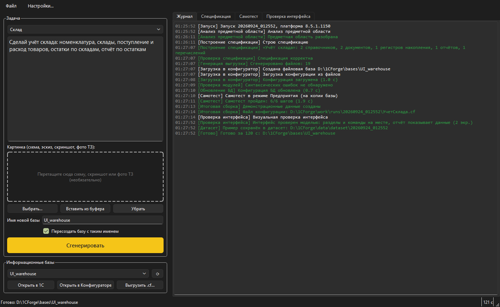
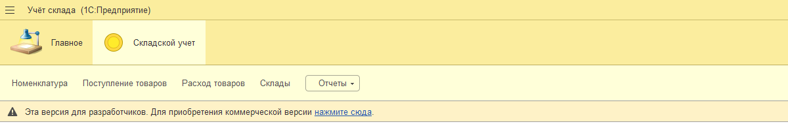
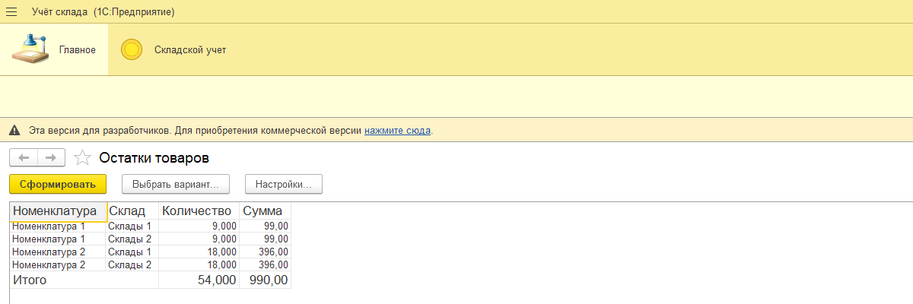
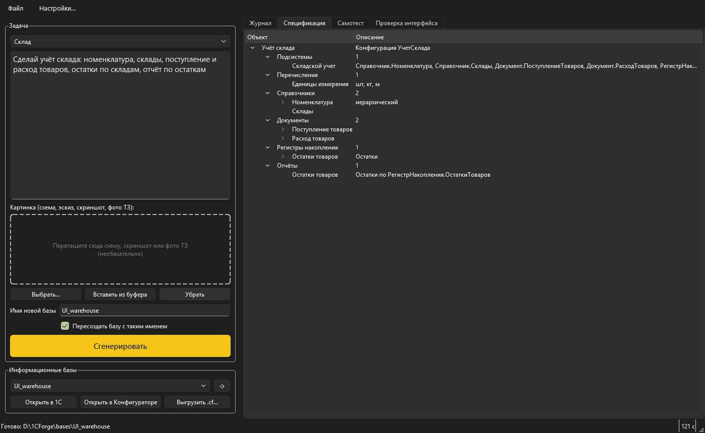
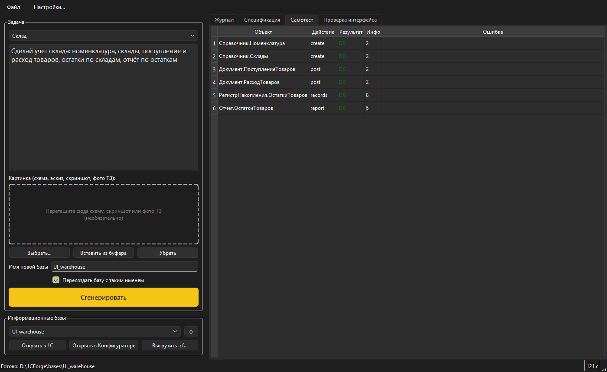
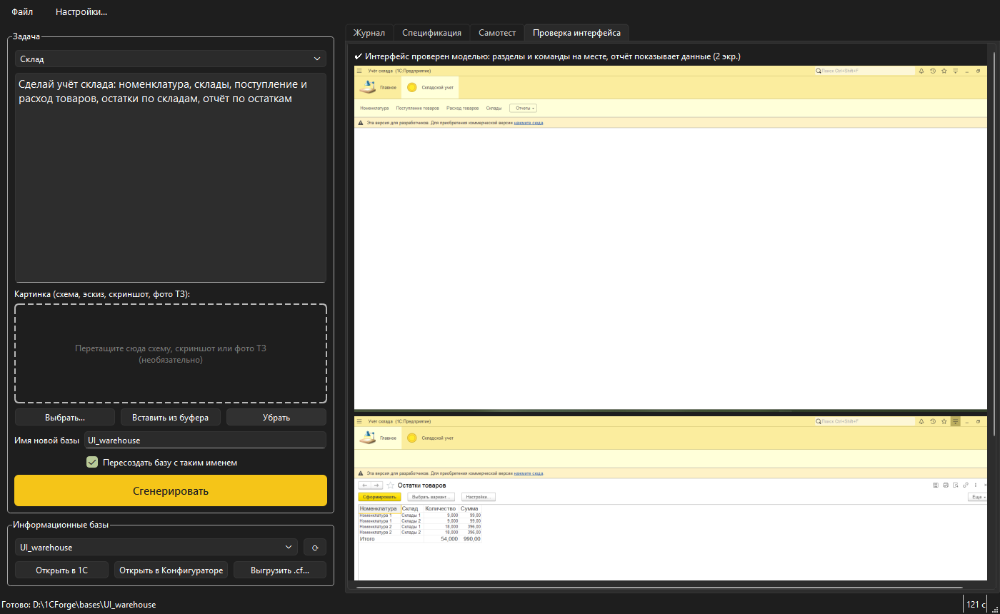

# 1C Forge

**Опишите учётную задачу словами и получите готовую базу 1С.**

**[Скачать программу: 1CForge-win64.zip](https://github.com/shebaketerayo/1c-forge/releases/latest/download/1CForge-win64.zip)** (71,5 МБ, Windows 10/11).
Внутри лежит `1CForge.exe`: распакуйте архив и запустите.

1C Forge — программа для Windows. Вы пишете по-русски, что нужно учитывать, например:

> Сделай учёт склада: номенклатура, склады, поступление и расход товаров, остатки по складам, отчёт по остаткам

Программа создаёт новую файловую информационную базу 1С:Предприятие 8.5 и собирает в ней рабочую конфигурацию:
справочники, документы с проведением, регистры накопления, отчёты на СКД, раздел интерфейса и тестовые данные.
Нейросеть работает прямо на компьютере (через Ollama). Облачных сервисов и ключей API нет.

> **Мало времени?** Прочитайте до раздела «Как проверить самим»: скриншоты, принцип работы и результаты проверок дают полную картину.
>
> **Хотите запустить?** Переходите к разделу [«Как проверить самим»](#как-проверить-самим): самый короткий путь занимает минуту и требует только платформу 1С 8.5.
>
> **Хотите увидеть программу в работе?** Полный режим требует мощного компьютера и нейросети размером около 16 ГБ, поэтому на чужом компьютере его обычно не запускают. Готов показать работу программы лично: пишите **`@detkayatebyaukraI`**.

## Скачать

**[1CForge-win64.zip](https://github.com/shebaketerayo/1c-forge/releases/latest/download/1CForge-win64.zip)**: 71,5 МБ, Windows 10/11 (64 бит). Устанавливать ничего не нужно.

Распакуйте архив в любую папку и запустите `1CForge.exe`. Папку `_internal` рядом с ним не удаляйте и не переносите отдельно: без неё программа не запустится.

- Windows может показать синее окно SmartScreen, потому что у программы нет платной цифровой подписи. Нажмите «Подробнее», затем «Выполнить в любом случае».
- SHA-256 архива для сверки: `9fdbd25705e51937681da972d4d5c414458ce9ddc9bf4ef1f10c43d407eb795c`.
- Остальные версии: [страница выпусков](https://github.com/shebaketerayo/1c-forge/releases).

## Как это выглядит



Слева задача: текст запроса и, если нужно, картинка (схема, эскиз, скриншот или фото ТЗ). Справа журнал, по нему видны все этапы.
На снимке запрос «Склад» из набора эталонных: программа прошла все этапы за 120 секунд. Кнопки внизу слева открывают созданную базу
в 1С или в Конфигураторе и выгружают её в файл `.cf`.

А вот что получилось в самой 1С: раздел «Складской учёт» и отчёт «Остатки товаров» на тестовых данных.





<details>
<summary>Ещё три вкладки окна: спецификация, самотест, проверка интерфейса</summary>

**Спецификация.** То, что построила нейросеть и проверил код: состав конфигурации в виде дерева.



**Самотест.** Программа запустила 1С в режиме Предприятия, создала элементы справочников, провела документы и проверила регистр и отчёт. Все шесть шагов пройдены.



**Проверка интерфейса.** Снимки раздела и отчёта, по которым нейросеть подтверждает, что разделы и команды на месте, а отчёт показывает данные.



</details>

## Что получается на выходе

Это обычная конфигурация, а не макет: её можно открыть в Конфигураторе и дорабатывать. Вот, например, модуль документа «Расход товаров»
из примера со складом. Он целиком сгенерирован программой:

```bsl
Процедура ОбработкаПроведения(Отказ, РежимПроведения)

	// Движения по регистру Остатки товаров
	Движения.ОстаткиТоваров.Записывать = Истина;
	Для Каждого СтрокаТЧ Из Товары Цикл
		Движение = Движения.ОстаткиТоваров.Добавить();
		Движение.ВидДвижения = ВидДвиженияНакопления.Расход;
		Движение.Период = Дата;
		Движение.Номенклатура = СтрокаТЧ.Номенклатура;
		Движение.Склад = Склад;
		Движение.Количество = СтрокаТЧ.Количество;
	КонецЦикла;

	// Контроль остатков по регистру Остатки товаров
	Движения.ОстаткиТоваров.БлокироватьДляИзменения = Истина;
	Движения.ОстаткиТоваров.Записать();
	Запрос = Новый Запрос;
	Запрос.Текст =
	"ВЫБРАТЬ
	|	Остатки.Номенклатура КАК Номенклатура,
	|	Остатки.Склад КАК Склад,
	|	Остатки.КоличествоОстаток КАК КоличествоОстаток
	|ИЗ
	|	РегистрНакопления.ОстаткиТоваров.Остатки(
	|			,
	|			(Номенклатура, Склад) В
	|				(ВЫБРАТЬ
	|					Т.Номенклатура, Т.Склад
	|				ИЗ
	|					РегистрНакопления.ОстаткиТоваров КАК Т
	|				ГДЕ
	|					Т.Регистратор = &Ссылка)) КАК Остатки
	|ГДЕ
	|	Остатки.КоличествоОстаток < 0";
	Запрос.УстановитьПараметр("Ссылка", Ссылка);
	Выборка = Запрос.Выполнить().Выбрать();
	Пока Выборка.Следующий() Цикл
		Отказ = Истина;
		Сообщение = Новый СообщениеПользователю;
		Сообщение.Текст = "Недостаточно остатка (Остатки товаров): " + Строка(Выборка.Номенклатура) + ", " + Строка(Выборка.Склад) + ". Не хватает: " + Строка(-Выборка.КоличествоОстаток);
		Сообщение.Сообщить();
	КонецЦикла;

КонецПроцедуры

Процедура ПередЗаписью(Отказ, РежимЗаписи, РежимПроведения)

	Для Каждого СтрокаТЧ Из Товары Цикл
		СтрокаТЧ.Сумма = СтрокаТЧ.Количество * СтрокаТЧ.Цена;
	КонецЦикла;

КонецПроцедуры
```

Здесь видно главное: проведение пишет движения в регистр остатков и сразу проверяет, что остаток не ушёл в минус. Если ушёл,
проведение отменяется с сообщением «Недостаточно остатка…». Такие вещи (движения по регистрам, контроль остатков, вычисляемые
колонки вроде «Сумма = Количество × Цена», обязательные поля) собираются из готовых шаблонов, а не сочиняются нейросетью каждый раз заново.

## Как это устроено

Главная мысль такая: **нейросеть не пишет конфигурацию, она заполняет анкету.** Если просить модель сразу выдать XML выгрузки
или готовые модули, легко получить правдоподобный, но нерабочий текст: формат платформы строгий, и конфигурация не загрузится
из-за любой мелочи. Поэтому работа поделена:

| Нейросеть (Gemma 4, локально через Ollama) | Обычный код |
|---|---|
| Понимает задачу, выбирает объекты и связи между ними, придумывает имена и заполняет **спецификацию**: JSON со строгой схемой | Проверяет и исправляет спецификацию, по шаблонам строит XML выгрузки (формат 2.21, платформа 8.5) и модули на встроенном языке, создаёт базу, загружает конфигурацию, проверяет модули, проводит документы |

Шаблоны сделаны по эталонной выгрузке, которую создала сама платформа, и проверяются тестом на побайтное совпадение.

Этапы работы:

1. **Картинка (по желанию).** Если приложена схема, эскиз, скриншот или фото ТЗ, модель с поддержкой изображений описывает её словами.
2. **Анализ предметной области.** Какие сущности нужны, как они связаны, что должны делать документы.
3. **Спецификация.** Анкета в JSON: справочники, документы, регистры, отчёты и, самое важное, *движения* документов по регистрам.
4. **Проверка спецификации** обычным кодом: имена по правилам 1С, ссылки только на существующие объекты, у регистра остатков есть и приход, и расход и так далее. Типовые ошибки исправляются автоматически, без модели.
5. **Генерация.** Шаблоны превращают спецификацию в конфигурацию: объекты, роль, подсистему, схему компоновки отчёта, модули проведения.
6. **Платформа 1С** в пакетном режиме создаёт базу, загружает конфигурацию, проверяет модули и обновляет конфигурацию базы данных.
7. **Самотест.** Программа запускает 1С:Предприятие, создаёт данные, проводит документы и проверяет, что регистры двигаются, а отчёты показывают данные.
8. **Исправление ошибок.** Если на любом этапе что-то не так, ошибка вместе с указанием места возвращается модели, и цикл повторяется (до четырёх попыток).
9. **Проверка интерфейса.** Снимки раздела и отчёта; модель подтверждает, что интерфейс на месте.

Что конфигурация рабочая, подтверждает не нейросеть, а платформа 1С: загрузка, проверка модулей, самотест.

Так выглядит кусочек анкеты, из которого получился модуль выше (сокращённо):

```json
{
  "name": "РасходТоваров",
  "movements": [{
    "register": "ОстаткиТоваров",
    "kind": "Расход",
    "table": "Товары",
    "fields": [
      {"target": "Номенклатура", "source": "Товары.Номенклатура"},
      {"target": "Склад",        "source": "Склад"},
      {"target": "Количество",   "source": "Товары.Количество"}
    ],
    "check_balance": true
  }]
}
```

Нейросеть отвечает только за смысл: расход двигает регистр остатков, и остаток нужно контролировать. Как это записывается на языке 1С, решает генератор.

## Что проверено

**Десять эталонных запросов:** склад, библиотека, школьный журнал оценок, автосервис, кадры, кафе, аренда, учёт оборудования, спортзал, ремонт техники.
В последнем прогоне (24.09.2026) все десять дали рабочую конфигурацию: она загрузилась, модули без ошибок, самотест пройден, а состав объектов
и направление движений по регистрам соответствуют запросу. Шесть запросов получились с первой попытки, остальным понадобилось две или три.
На все десять ушло 24 минуты и 25 обращений к модели. Таблица: [docs/E2E_REPORT.md](docs/E2E_REPORT.md), сами результаты: [examples](examples/).

**Насколько это надёжно.** Десять из десяти получилось в одном прогоне, и это не гарантия. В предыдущих прогонах выходило 7–8 из 10, и каждый раз
«спотыкались» разные запросы: нейросеть на один и тот же запрос отвечает по-разному. Каждый провал разобран, превращён в правило проверки и в автотест.
Например, «оплата» сначала увеличивала долг арендатора вместо уменьшения, теперь смысл движения проверяется.
Список таких находок: [docs/E2E_HISTORY.md](docs/E2E_HISTORY.md).

**Автотесты** (всего 195):

- 169 модульных, им не нужны ни 1С, ни модель: имена и типы, автоисправление спецификаций, «золотой» тест генератора, разбор логов платформы, поведение окна.
  Прогон 06.10.2026: прошли все 169.
- 21 интеграционный на настоящей платформе 1С: создание базы, загрузка, самотест, круговой обмен «сгенерировали → загрузили → выгрузили», контроль остатков.
  Прогон 06.10.2026: прошли все 21 (около двух минут).
- 4 теста с моделью и 1 сквозной на эталонных запросах. Сквозной прогон описан выше (24.09.2026); сегодня эти тесты не запускались, им нужна запущенная Ollama.

**Результаты воспроизводятся.** 06.10.2026 все десять итоговых спецификаций заново пропустили через генератор и платформу, уже без нейросети.
Все десять собрались и прошли самотест (от 6 до 15 шагов в зависимости от конфигурации).
Упакованный `1CForge.exe` проверен так же: окно запускается, встроенная самопроверка проходит, из готовой спецификации собирается база за 8–19 секунд.

## Как проверить самим

Проверить можно на разную глубину, выбирайте по времени.

### 1. Просто посмотреть (5 минут, ничего ставить не нужно)

Скриншоты выше, [таблица результатов](docs/E2E_REPORT.md) и папка [examples](examples/): десять готовых конфигураций.
Модули на встроенном языке читаются прямо на GitHub, например [проведение расхода](examples/01_warehouse/src/Documents/%D0%A0%D0%B0%D1%81%D1%85%D0%BE%D0%B4%D0%A2%D0%BE%D0%B2%D0%B0%D1%80%D0%BE%D0%B2/Ext/ObjectModule.bsl).

### 2. Открыть готовую конфигурацию в 1С (нужна платформа 8.5)

Любой `.cf` из [examples](examples/) загружается в пустую базу через Конфигуратор. Пошагово: [examples/README.md](examples/README.md#как-открыть-конфигурацию-в-1с).

### 3. Запустить программу без нейросети (нужна платформа 8.5, около минуты)

1. Скачайте и распакуйте архив (см. «Скачать»).
2. Дважды щёлкните `check_without_ai.bat` рядом с `1CForge.exe`. Подождите: окна с ходом работы не будет, обычно всё занимает меньше минуты.
3. Программа соберёт из готовой спецификации базу «Учёт склада» с тестовыми данными, пройдёт самотест и добавит базу в список баз 1С, в папку «1C Forge».
   Откройте её в режиме Предприятия: справочники, документы, отчёт «Остатки товаров». Попробуйте провести расход больше остатка, и сработает контроль.

Если платформа 8.5 на компьютере не найдена, появится окно с ошибкой. Закройте его, и `.bat` объяснит возможную причину.
Созданную базу можно также открыть из самой программы: в `1CForge.exe` внизу слева есть список баз и кнопки «Открыть в 1С», «Открыть в Конфигураторе», «Выгрузить .cf», они работают без нейросети.

### 4. Полный режим: описание словами → база

Здесь нужны Ollama, модель размером порядка 16 ГБ и достаточно мощный компьютер, поэтому ради проверки это обычно не запускают.
Проще посмотреть вживую: **готов показать работу программы лично, контакт `@detkayatebyaukraI`.**

Если хочется запустить самим:

1. Установите [Ollama](https://ollama.com) и скачайте модели: `ollama pull gemma4:26b-a4b-it-qat` (порядка 16 ГБ) и `ollama pull bge-m3`.
2. Запустите `1CForge.exe`, выберите в списке эталонный запрос (например, «Склад») или напишите свой и нажмите «Сгенерировать». Ход работы виден в журнале.
3. Готовую базу откройте кнопкой «Открыть в 1С».

На моём компьютере (видеокарта 8 ГБ, 32 ГБ оперативной памяти) один запрос занимает от полутора до пяти минут.

## Что нужно для запуска

| Для чего | Что нужно |
|---|---|
| Запустить программу | Windows 10 или 11, 64 бит (проверено на Windows 11). Python и другие программы ставить не нужно |
| Создавать и проверять базы | Платформа 1С:Предприятие **8.5**. Проверено на 8.5.1.1150 (бесплатная «версия для разработчиков»). Платформа 8.3 не подойдёт: конфигурации создаются в формате 8.5 |
| Описывать задачу словами | [Ollama](https://ollama.com) и модели `gemma4:26b-a4b-it-qat` (около 16 ГБ в памяти) и `bge-m3` (1,2 ГБ). Для слабых компьютеров есть модели поменьше, но качество ниже, см. [docs/MODEL.md](docs/MODEL.md) |

Базы создаются в `D:\1CForge\bases` (если диска D: нет, то в папке `1CForge` в профиле пользователя). Журнал каждого запуска лежит рядом, в `work\runs\<время>\`:
спецификация, логи платформы, результат самотеста, снимки экрана. Пути, модели и число попыток меняются кнопкой «Настройки…» в окне.
Там же есть режим «Через сервер 1C Forge»: нейросеть работает на другом компьютере с видеокартой, а база собирается на этом. Для проверки он не нужен.

## Чего программа не умеет

Границы, о которых лучше знать заранее.

- **Состав объектов ограничен.** Справочники (в том числе иерархические и подчинённые), документы с табличными частями, перечисления, константы,
  регистры сведений и накопления, отчёты на СКД, подсистемы, роль с полными правами. Планов видов характеристик, планов счетов, регистров бухгалтерии
  и бизнес-процессов нет. Формы стандартные, индивидуальные программа не рисует.
- **Нестандартная логика** возможна только как короткие обработчики событий («ПередЗаписью», «ОбработкаЗаполнения» и подобные). Их текст пишет нейросеть,
  и он проходит те же проверки платформы.
- **Результат нужно смотреть глазами.** Нейросеть может понять задачу не так, как задумывалось. Известный пример: в конфигурации «Учёт оборудования»
  место установки получилось измерением регистра сведений, а не ресурсом, а списание пишет количество 1, поэтому отчёт «где сейчас оборудование» покажет и списанное.
  Автоматические проверки это пока не ловят.
- **Не заменяет программиста 1С.** Это быстрый каркас, который потом дорабатывают руками.
- **Только платформа 8.5** (проверено на 8.5.1.1150, «версия для разработчиков») и только файловые базы. Учебная и коммерческая версии на этом стенде не проверялись.

## Что лежит в репозитории

- [README.md](README.md): этот текст.
- [examples/](examples/): десять готовых конфигураций с запросами и спецификациями.
- [docs/](docs/): рабочие заметки: [FEASIBILITY.md](docs/FEASIBILITY.md) (что проверено на платформе до начала разработки: пакетный режим, формат выгрузки, поведение при ошибках),
  [MODEL.md](docs/MODEL.md) (выбор и замеры модели), [E2E_REPORT.md](docs/E2E_REPORT.md) и [E2E_HISTORY.md](docs/E2E_HISTORY.md) (результаты прогонов).
- Сама программа лежит в архиве на странице [выпусков](https://github.com/shebaketerayo/1c-forge/releases).

В заметках из `docs/` встречаются ссылки на папки `app/` и `scripts/`: это рабочий репозиторий с исходным кодом, здесь он не выложен.

«1С:Предприятие» — товарный знак фирмы «1С». Проект не связан с фирмой «1С» и не является её продуктом.
